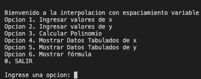
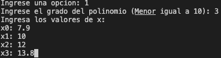
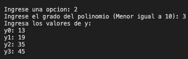
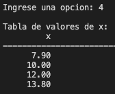
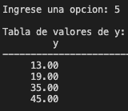
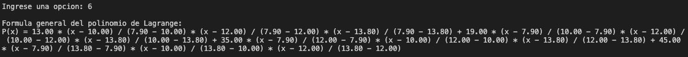
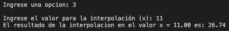
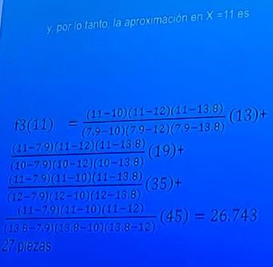

# Método Lagrange

## Este es el Proyecto final de las materias POO y Métodos numéricos.

## Integrantes del equipo 

* Alexis Daniel Cortes Tavera 22310259
* Edgar Javier Fregoso Cuarenta 22310285

## Historia
El polinomio de Lagrange, llamado así en honor a Joseph-Louis de Lagrange, es una forma de presentar el polinomio que interpola un conjunto de puntos dados. 

Dado que no existe un único polinomio interpolador para un determinado conjunto de puntos, un nombre más apropiado es interpolación polinómica en la forma de Lagrange.

**¿Para que sirve?**

El sistema de Lagrange, es utilizado en el campo de la mecánica celeste para identificar ubicaciones específicas en el espacio donde las fuerzas de dos cuerpos celestes producen condiciones estables.

## Ejecución

+ Deberemos compilar en una terminal el siguiente comando, el cual nos ejecutara el menú principal 

> [!IMPORTANT] 
> Se deben ingresar las opciones 1 y 2 en conjunto antes de realizar las siguientes opciones

+ Aquí podemos ver el menú principal con las opciones 

 

> [!NOTE]
> Se debe tener un conocimiento básico sobre el funcionamiento de este metodo ya que una parte fundamental es conocer el grado del polinomio para determinar los sumantes, e ingresar ese valor en ambas opciones

+ Una vez seleccionada opcion 1 ó 2, se preguntara el grado de polinomio, lo ingresamos y calculará la cantidad de datos que debe recibir del usuario para hacer el calculo 

 

+ Ahora Verificaremos con las opciones 4 y 5 los datos tabulados, todo es correcto, ahora comprobemos la formula que se usara para este caso (Varía según el grado de polinomio)

+ Para el Calculo de la interpolación usaremos la opcion 3, la cual nos preguntará cual es el valor que queremos calcular, para este ejemplo será 11

**Comprobación**

## Reto practico

Para la funcion tabular. Obtener el valor de y para x = 2.

